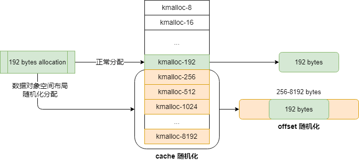

# ERA-eBPF-assisted-Randomize-Allocator

cite:
```
@Article{1,
title = {基于eBPF的内核堆漏洞动态缓解机制},
author = {王子成,郭迎港,钟炳南,陈越琦,曾庆凯},
 journal = {软件学报},
 volume = {},
 number = {},
 pages = {1},
 numpages = {},
 year = {},
 month = {},
 doi = {10.13328/j.cnki.jos.006923},
 publisher = {科学出版社}
}
```

Kernel heap vulnerability is one of the main threats to operating system security today. 

User-space attackers can leak or modify sensitive kernel information, disrupt kernel control flow, and even gain root privilege by triggering a vulnerability. 

However, due to the rapid increase in the number and complexity of vulnerabilities, it often takes a long time from when a vulnerability is first reported to when the developer issues a patch, whereas kernel mitigations are steadily bypassed

so we propose a eBPF assisted Randomize Allocator, inspired by [HOTBPF](https://www.youtube.com/watch?v=1KSLTsgxaSU), but adopt a randomization mechanism, put a vulnerable or potential victim object in the randomize slot in a randomize slab cache.

The average probability of a successful exploitation is about 1/600,000



so that a vulnerable object cannot overlap a victim/payload object. e.g. CVE-2022-34918


the performance and memory overhead are acceptable, only about 1%.

## performance


## memory

the memory and slab relative overhead.

- blue: ERA disabled
- red: ERA **enabled**

.png)

.png)
